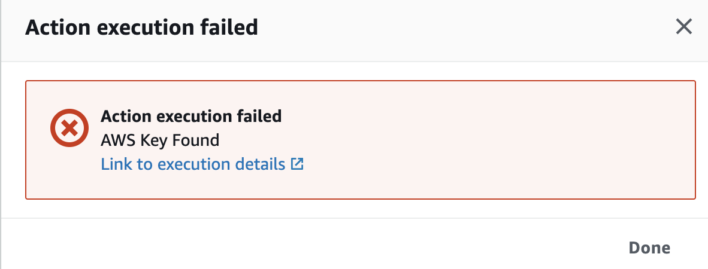

<!--
Testing the lambda function created in the previous module.
--> 
# Module 4:  Finding AWS Keys

Unfortunately, not all code committed into a source repository will be free of secrets.  In this module, as a developer, you will see what security automation can do to help keep confidential information such as AWS keys stay out of source repositories.

1.	Release change to start the code building again on the updated pipeline. Oops – the code had some stray AWS credentials in it – but this time we’ve caught them and stopped the build!

2.	Remove the credentials.
    1.	Edit resource.json and remove the offending credentials.
    2.	Rezip the “codepipe-AWS-devsecops.zip” (the exact name is important)
    3.	Upload the zip to s3.
3.	Come back to the DevSecOps pipeline and watch it through the stages again.

!!! question "Can you use IAM roles instead?"

